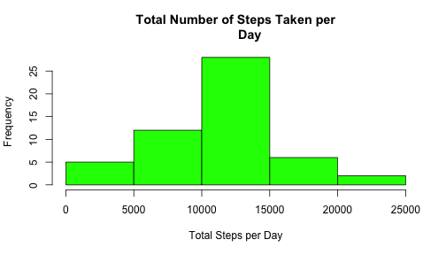
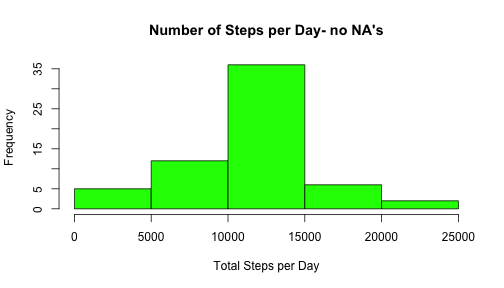

# Reproducible Research: Peer Assessment 1

Data: https://d396qusza40orc.cloudfront.net/repdata%2Fdata%2Factivity.zip

## Loading and preprocessing the data
The following code loads the downloaded "activity.csv" data set for analysis:

```r
data <- read.csv("activity.csv", header = TRUE)
```

## What is mean total number of steps taken per day?
Histogram of the total number of steps taken each day:

```r
steps.per.day <- sapply(split(data$steps, data$date), sum)
```

```r
hist(steps.per.day, col = "green", main = "Total Number of Steps Taken per
        Day", xlab = "Total Steps per Day")
```

 

Mean total number of steps per day:

```r
mean.steps <- mean(steps.per.day, na.rm = TRUE)
mean.steps
```

```
## [1] 10766
```

Median total number of steps per day:

```r
median.steps <- median(steps.per.day, na.rm = TRUE)
median.steps
```

```
## [1] 10765
```

## What is the average daily activity pattern?
Plot of avergae steps taken per interval, across all days:

```r
steps.per.interval <- sapply(split(data$steps, data$interval), mean, 
                                na.rm = TRUE)
```


```r
plot(steps.per.interval, type = "l", main = "Average Daily Activity Pattern", 
        xlab = "5-Minute Interval", ylab = "Average Steps")
```

 
 
Which interval contains the maximum number of steps?

```r
which(steps.per.interval == max(steps.per.interval))
```

```
## 835 
## 104
```
Interval "835" contains the maximum number of steps.


## Imputing missing values
Total number of missing values in original dataset:

```r
sum(!complete.cases(data))
```

```
## [1] 2304
```

Create new dataset "complete.data" that replaces the NA values from the original dataset with the average steps for that particular interval:

```r
complete.data <- data
for (i in 1:nrow(complete.data)) {
    if (is.na(complete.data[i, "steps"])) {
        interval = as.character(complete.data[i, "interval"])
        complete.data[i, "steps"] = steps.per.interval[interval]
    }
}
```

Histogram of the total number of steps taken each day:

```r
complete.steps.per.day = sapply(split(complete.data$steps, 
                                        complete.data$date), sum)
```

```r
hist(complete.steps.per.day, col = "green", main = "Number of Steps per Day- no NA's", xlab = "Total Steps per Day")
```

 

Mean total number of steps per day:

```r
complete.mean.steps <- mean(complete.steps.per.day)
complete.mean.steps
```

```
## [1] 10766
```

Median total number of steps per day:

```r
complete.median.steps <- median(complete.steps.per.day)
complete.median.steps
```

```
## [1] 10766
```

Analysis of imputing missing data on estimates of total daily number of steps:
The mean total number of steps per day is the same whether it is calculated with data containing missing values, or data whose missing values are replaced with the mean steps of the missing values associated interval. The median rises slightly as a result of the new data set.

## Are there differences in activity patterns between weekdays and weekends?
Create a new factor variable in the dataset with two levels – “weekday” and “weekend” indicating whether a given date is a weekday or weekend day:


```r
complete.data$weekday <- weekdays(as.Date(complete.data$date, format = "%Y-%m-%d"))
complete.data$weekday.type <- factor(ifelse(complete.data$weekday == "Sunday" | complete.data$weekday == 
    "Saturday", "weekend", "weekday"), levels = c("weekday", "weekend"))
complete.data.weekdays <- complete.data[complete.data$weekday.type == "weekday", ]
complete.data.weekend <- complete.data[complete.data$weekday.type == "weekend", ]
weekday.steps <- sapply(split(complete.data.weekdays$steps, 
                        complete.data.weekdays$interval), mean)
weekend.steps <- sapply(split(complete.data.weekend$steps, 
                        complete.data.weekend$interval), mean)
```

Plot weekday data and weekend data:

```r
par(mfrow = c(2, 1), mar = c(4, 5, 2, 2))
plot(weekend.steps, type = "l", main = "Weekend", ylab = "", xlab = "Interval")
plot(weekday.steps, type = "l", , main = "Weekday", ylab = "", xlab = "Interval")
par(mfrow = c(1, 1), mar = c(3, 2, 2, 2))
mtext(text = "Number of steps", side = 2)
```

 

